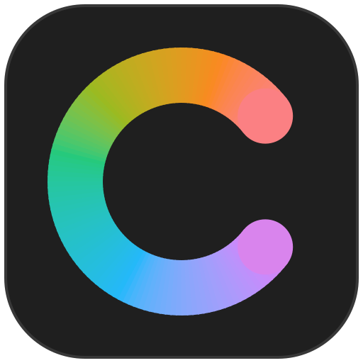

# Colorize



Offline desktop color manager with an Adobe-style interface. Plan: `colorize-plan.md`.

## Setup

`python` on this machine's PATH is Inkscape's bundled interpreter, so create the venv
with the Python launcher:

```
py -3.14 -m venv .venv
.venv\Scripts\python -m pip install -r requirements.txt
```

## Run

```
.venv\Scripts\python -m colorize
```

## Test

```
.venv\Scripts\python -m pytest
```

UI tests run headless (`QT_QPA_PLATFORM=offscreen`, set in `tests/conftest.py`).

## Layout

```
colorize/
  core/      color math, no Qt: hex/OKLCH, harmony rules, sRGB gamut mapping,
             NumPy OKLab renderer, k-means palette extraction, image loading (ICC -> sRGB),
             WCAG 2.x / APCA contrast, color vision deficiency simulation
  model/     Palette, Document (+ QUndoStack), AppState, HarmonyModel, undoable commands
  ui/        shell, panels, document canvas, preferences
    themes/  tokens (dark / gray / light), generated QSS, recolored SVG icons
    fonts/   Source Sans 3 (SIL OFL, license alongside)
    assets/  logo.svg and colorize.ico (generated by tools/make_logo.py)
  formats/   palette files: native JSON (M1); ASE, GPL, CSS, Tailwind, tokens (M4)
  storage/   SQLite (M4)
```

## Color decisions

- Harmony wheel: angle = OKLCH hue, radius = chroma, at the base color's lightness.
  The dimmed part of the wheel is outside sRGB.
- Out-of-gamut colors are mapped with CSS Color 4 style chroma reduction
  (coloraide `oklch-chroma`) and flagged: dashed handles, ⚠ on swatches, a warning in
  the color picker (click it to snap to the gamut edge).
- Hue rules keep lightness and chroma; monochromatic steps lightness by 0.12.

## Images

Open an image (File › Open, Ctrl+Shift+O, or drop it on the window) to extract a palette:

- The embedded ICC profile is applied first (e.g. Display P3 photos from phones), then
  the image is scaled to ~200 px and clustered with k-means++ in OKLab, seeded, so the
  same image always gives the same palette. Transparent pixels are ignored.
- Markers on the image show where each color comes from; drag one to re-sample it.
- *New Palette* makes a palette document from the colors; *Add to Swatches* appends them
  to the active palette (the last palette tab you used).
- The Eyedropper (I) samples the image (point, 3×3 or 5×5 average in linear light).
  *Sample Screen Color* (Shift+I) picks from anywhere on any monitor.

## Accessibility

**Contrast** (tool C): the foreground is the text, the background is the background
(X swaps them; Alt+click with the Eyedropper sets the background).

- WCAG 2.x ratio with AA / AAA / large text / UI (3:1) results. Ratios are shown
  truncated to two decimals, like the WebAIM checker, so 4.499 never reads as 4.50.
- APCA Lc (APCA-W3 0.0.98G-4g constants) with bronze-level guidance. Shown as
  guidance only: WCAG 2.x is the conformance standard.
- *Fix for*: the closest text colors that pass the chosen target, found by moving only
  OKLCH lightness (hue kept, chroma reduced just enough to stay in sRGB).

**Color blindness** (tool B):

- Simulation with the Machado, Oliveira & Fernandes (2009) matrices in linear RGB,
  severity 0–100% (below 100% is the -anomaly form), plus achromatopsia. The table is
  verified against the copy in the `colour-science` library.
- The panel shows the active palette for each type and warns about pairs that become
  hard to tell apart (OKLab distance < 0.06 after simulation).
- *View › Proof Colors* (Ctrl+Y) shows palettes and images as seen with the chosen
  type, like Photoshop's color blindness proof. The eyedropper still reads the
  original colors.

## Palette files

`File › Save` writes UTF-8 JSON:

```json
{"format": "colorize.palette", "version": 1, "name": "Brand", "colors": [{"hex": "#3D6A9E"}]}
```

Rules: `core/` stays Qt-free; the UI never edits a Palette directly, only through
`Document` methods that push undo commands.

## Shortcuts

| Key | Action |
|---|---|
| V I W E C B H Z | Select, Eyedropper, Harmony, Extract, Contrast, Color Blindness, Hand, Zoom |
| Shift+I | Sample a color from anywhere on screen |
| Alt+click (Eyedropper) | Set the background color instead |
| Ctrl+Y | Proof colors (color blindness simulation) |
| Ctrl+O / Ctrl+Shift+O | Open palette or image / open image |
| Ctrl+S / Ctrl+Shift+S | Save / save as |
| Space (hold) | Temporary Hand tool |
| X / D | Swap / default foreground and background |
| Tab | Show/hide all panels and bars |
| Shift+F1 / Shift+F2 | Darker / lighter interface |
| Ctrl+K | Preferences |
| Ctrl+Z, Ctrl+Shift+Z | Undo, redo |
| Ctrl+= / Ctrl+- / Ctrl+0 / Ctrl+1 | Zoom in / out / fit / 100% |
| Del | Delete selected swatch |

Settings (theme, window, panel layout, custom workspaces) are stored in
`%APPDATA%\Colorize\Colorize.ini`.

## License

Code: MIT, see `LICENSE`. The bundled Source Sans 3 font is licensed separately under the
SIL Open Font License (`colorize/ui/fonts/OFL-SourceSans3.txt`).
